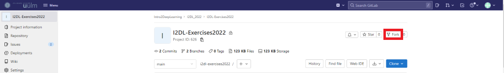
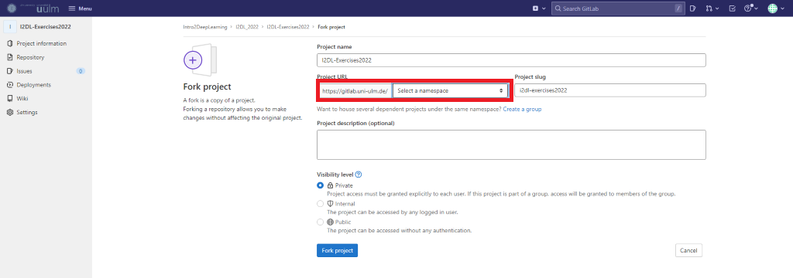

# I2DL-Exercises2022


## Git Enviroment Setup

We will use [Git](https://git-scm.com/) to distribute and hand in exercises. You can either [use Git directly from the command line](./github-git-cheat-sheet.pdf) or use a [**G**raphical **U**ser **I**nterface (GUI)](https://git-scm.com/downloads/guis) to use it. If you have never used Git before, we recommend that you work through one of the introductions available online.

### Forking the Repository

Every student will work within their fork of the main repository, where they can upload their results. Follow these steps to set up your fork:

1. Navigate to the [main exercise repository.](https://gitlab.uni-ulm.de/intro2deeplearning/i2dl_2022/i2dl-exercises2022)

2. Click on the fork button on the top right.


3. Select your namespace and confirm the project Fork.


4. Clone the forked repository to your local machine using either the command line or a GUI.

### Keeping your Fork Up-to-date

To synchronize your fork with the main exercise repository, once new exercises are uploaded, you need to add it as a remote upstream repository to your fork.
This can be done by executing the following in the command line in your fork.
```
git remote add upstream git@gitlab.uni-ulm.de:intro2deeplearning/i2dl_2022/i2dl-exercises2022.git
```
Once this is set up, you can synchronize the fork and main repositories by executing the command.
```
git pull upstream main to your personal fork 
```

### Hand In Results

To hand in results, you push your work to your fork and clearly designate it as your solution. 
You also have to add Julia and Luzius as Developers to your fork for us to see your work.


## Exercise Envirement Setup

For developing your code for the exercises, you only need a working 64-bit python
installation, as well as the pip package manager to install the **numpy**, **jupyterlab**,
**sklearn**, **torch**, **torchvision**, **matplotlib** and **tqdm** packages. You can download
the python interpreter via the package manager of your Linux distribution or from
[https://www.python.org/downloads/](https://www.python.org/downloads/) (e.g. on Windows), where it should already
come with pip. Most Linux distributions and MacOS already have a Python interpreter
pre-installed. You can also use [Anaconda](https://www.anaconda.com/distribution/)
if your Linux distribution comes with an outdated python version such as Python 2 or
Python 3.5. On Windows, Installation with Anaconda was found to be easier and less
error-prone. The exercises and solutions are tested with Python 3.8, but should also
work with Python 3.6 or later.

#### Option 1: With Python3 venv (Recommended on Linux or Mac)

With the venv python module, one can create a new virtual environment. This is
basically a folder in which all the packages that we are going to need will be installed. This avoids cluttering your local python installation with too many modules,
and conflicts with already installed modules. To create a new environment in the folder
**./exercises_env**, run:
```
python3 -m venv ./exercises_env
```
After your virtual environment has been created, you can enter it with
```
source ./exercises_env/bin/activate
```
For Windows or other shells than bash/zsh, see [https://docs.python.org/3/library/venv.html#creating-virtual-environments](https://docs.python.org/3/library/venv.html#creating-virtual-environments).  
You will need to activate the environment in each new terminal session that you create.
After the *source* command, the current shell should now use the correct Python3
version, which you can verify with
```
python --version
pip --version
which python
which pip
```
Both should point to a Python 3 installation in the *exercises_env* subdirectory.
Then, you should install PyTorch with
```
pip install --upgrade pip
pip install setuptools wheel
pip install torch torchvision

```
Note: This installs PyTorch with support for NVIDIA GPUs. If you don’t have a
GPU and want to save some disk space, or if you have a ROCm-capable AMD GPU, you
can use alternative installation commands from [https://pytorch.org/get-started/locally/](https://pytorch.org/get-started/locally/).  
Install the rest of the dependencies:
```
pip install matplotlib sklearn tqdm jupyterlab packaging ipywidgets
```
To leave the virtual environment, you can type *deactivate* (or simply close your
terminal).

#### Option 2: With anaconda (Recommended on Windows)

Download Anaconda from [https://www.anaconda.com/products/individual](https://www.anaconda.com/products/individual) in a 64-
bit version for your operating system and follow the installation procedure. On Windows,
you can then open an Anaconda Prompt via the system menu. On Linux, the conda
command should be available in your shell after opening a new shell.  
With Anaconda, you can also create multiple virtual environments, which can each
have their own python modules installed (and even different python interpreter versions).  
You can create a new anaconda environment with
```
conda create -n exercises_env
```
To use the virtual environment, you need to activate it with
```
conda activate exercises_env
```
You will need to activate the environment in each new terminal session that you create.
Then, install the PyTorch:  
With NVIDIA GPU support
```
conda install pytorch torchvision cudatoolkit=10.2 -c pytorch
```
Without GPU support
```
conda install pytorch torchvision cpuonly -c pytorch
```
Then, install the rest of the dependencies:
```
conda install matplotlib scikit-learn tqdm packaging ipywidgets
conda install -c conda-forge jupyterlab
```
### Test your installation
You can try out your installation by running *python* and importing the modules:
```
import torch
import torchvision
import numpy
import matplotlib
import tqdm
import sklearn
```
If you don’t get any errors, your installation was successful. You can exit the interpreter session with *Ctrl+D* or *exit()*.
### Running code in jupyter
For the exercises, we will use the jupyterlab package to be able to quickly run and
visualize code snippets. To run jupyter:
```
jupyter lab
```
With this, jupyter should be available in your web browser at [http://localhost:8888](http://localhost:8888) (or use the link that is shown in the console window).  
Try out jupyter by creating a new notebook via the *File > New > Notebook* menu,
and inserting python code in the cell in the notebook, such as:
```
import torch
print("Hello World")
print(torch.randn((4, 4))) # creates a 4x4 matrix of random values from a normal distribution
```
To edit a cell’s content, select it using the mouse or arrow keys, then press *Enter*. You
can run a code cell (with the python interpreter) with the shortcut *Ctrl+Enter*. The
output of the command will be displayed below the cell. When you save the notebook
via *File > Save notebook*, the saved file will contain both your code and the generated
output. The files are by default stored in the directory from which you ran *jupyter lab*.  
The exercises will in most cases begin with a jupyter notebook which contains some
code to setup the task and describing the exercise. For obtaining the bonus, you will
need to submit your solutions as saved jupyter notebooks (*.ipynb* files), containing your
solution and results.  
As a first step, you can familiarize yourself with jupyter and python by performing
some experiments in the notebook or by having a look at a few interesting example
notebooks:

* Matplotlib support: [https://nbviewer.jupyter.org/github/ipython/ipython/blob/master/examples/IPython%20Kernel/Plotting%20in%20the%20Notebook.ipynb](https://nbviewer.jupyter.org/github/ipython/ipython/blob/master/examples/IPython%20Kernel/Plotting%20in%20the%20Notebook.ipynb)

* More extensive matplotlib tutorial: [https://nbviewer.ipython.org/github/jrjohansson/scientific-python-lectures/blob/master/Lecture-4-Matplotlib.ipynb](https://nbviewer.ipython.org/github/jrjohansson/scientific-python-lectures/blob/master/Lecture-4-Matplotlib.ipynb)

